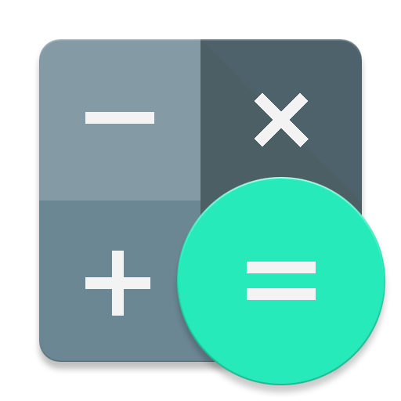

<div align = center>

![][views] ![][stars] ![][forks] ![][issues] ![][license] ![][code-size] ![][commit-activity]



# Calculator

**v0.2.4**

### A Simple but elegant Calculator app made with Flutter using Google's Material Design with Currency (Exchange Rate) and Unit Converter.

## ![][android] Download APK

---

**[<kbd> <br> **Universal Release** <br> </kbd>][universal-release]** &nbsp;&nbsp;
**[<kbd> <br> **arm64** <br> </kbd>][arm64]**&nbsp;&nbsp;
**[<kbd> <br> **armabi** <br> </kbd>][armabi]**&nbsp;&nbsp;
**[<kbd> <br> **x86_64** <br> </kbd>][x86]**&nbsp;&nbsp;
**[<kbd> <br> **Source Code (zip)** <br> </kbd>][sc-zip]**&nbsp;&nbsp;
**[<kbd> <br> **Source Code (tar.gz)** <br> </kbd>][sc-tar.gz]**

---

## 📱 App UI

<details><summary> Click here to expand </summary>

| ![][1] | ![][2] | ![][3] |
| :----: | :----: | :----: |
| ![][4] | ![][5] | ![][6] |
| ![][7] | ![][8] | ![][9] |

</details>

## 🔨 Building from Source

</div>

- If you don't have Flutter SDK installed, please visit official [Flutter](https://flutter.dev/) site.
- Fetch latest source code from master branch.

```sh
git clone https://github.com/rajput-hemant/calculator
cd calculator
```

- Rename **`.env.example`** -> **`.env`** and add your Currency API Key.

```sh
# Free Currency API Key (https://freecurrencyapi.com)
CURRENCY_API_KEY="" # <- Add your API Key here
```

- Run the app with Android Studio or VS Code. Or the command line:

```sh
flutter pub get
flutter run
```

<div align = center>

## 📜 License

This project is licensed under the GPL-3.0 License - see the [LICENSE](LICENSE) file for details.

## 🦾 Contributors:

<a href="https://github.com/rajput-hemant/calculator/graphs/contributors" target="blank"> 

</div>

<!----------------------------------{ Screenshots }--------------------------------->

[1]: https://graph.org/file/9b81e5cd961e6b41d7e1e.jpg
[2]: https://graph.org/file/9b0b318ec9f4f281ceac9.jpg
[3]: https://graph.org/file/4e23fead48c34a1534e61.jpg
[4]: https://graph.org/file/a67873cc5044cbef9d21f.jpg
[5]: https://graph.org/file/e675d889a9ee13433ab36.jpg
[6]: https://graph.org/file/9c68ca2b2abd03e972921.jpg
[7]: https://graph.org/file/d021ac5969a9a64ab8185.jpg
[8]: https://graph.org/file/e5d8cccebd8e69603c7b1.jpg
[9]: https://graph.org/file/98abd8747f8920d1ce0ef.jpg
[android]: https://telegra.ph/file/f2f70a74d2d92c3c7f688.png

<!------------------------------------{ apk }----------------------------------->

[universal-release]: https://github.com/rajput-hemant/calculator/releases/download/v0.2.4/Calculator-v0.2.4-universal-release.apk
[arm64]: https://github.com/rajput-hemant/calculator/releases/download/v0.2.4/Calculator-v0.2.4-arm64-v8a-release.apk
[armabi]: https://github.com/rajput-hemant/calculator/releases/download/v0.2.4/Calculator-v0.2.4-armeabi-v7a-release.apk
[x86]: https://github.com/rajput-hemant/calculator/releases/download/v0.2.4/Calculator-v0.2.4-x86_64-release.apk

<!--------------------------------{ source code }------------------------------->

[sc-zip]: https://github.com/rajput-hemant/calculator/archive/refs/tags/v0.2.4.zip
[sc-tar.gz]: https://github.com/rajput-hemant/calculator/archive/refs/tags/v0.2.4.tar.gz

<!----------------------------------{ Labels }--------------------------------->

[views]: https://komarev.com/ghpvc/?username=calculator&label=view%20counter&color=red&style=flat
[code-size]: https://img.shields.io/github/languages/code-size/rajput-hemant/calculator
[issues]: https://img.shields.io/github/issues-raw/rajput-hemant/calculator
[license]: https://img.shields.io/github/license/rajput-hemant/calculator
[commit-activity]: https://img.shields.io/github/commit-activity/w/rajput-hemant/calculator
[forks]: https://img.shields.io/github/forks/rajput-hemant/calculator?style=flat
[stars]: https://img.shields.io/github/stars/rajput-hemant/calculator
